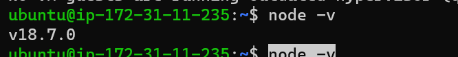
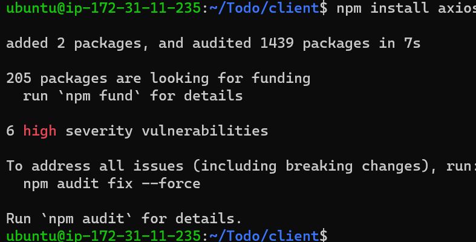

# **WEB STACK IMPLEMENTATION (MERN STACK)**

In this project, we are tasked to implement a web solution based on MERN stack in AWS Cloud. 

MERN stands for (MongoDB, ExpressJS, ReactJS, Node.js)

## STEP 0 – *PREPARING PREREQUISITIES*

In order to complete this project we need an AWS account and a virtual server with Ubuntu Server OS similar to [project-1](https://github.com/Tobyumeh01/Project-1) and [project-2](https://github.com/Tobyumeh01/Project-2)

## STEP 1 - *BACKEND CONFIGURATION*

- Update Ubuntu

`sudo apt update`

the result is;

- Upgrade Ubuntu

`Sudo apt upgrade`

- get the location of Node.js software from Ubuntu repositories.

`curl -fsSL https://deb.nodesource.com/setup_18.x | sudo -E bash -`

### Install Node.js on the server

- Install Node.js with the command below

`sudo apt-get install -y nodejs`

The command above installs both nodejs and npm. NPM is a package manager for Node like apt for Ubuntu, it is used to install Node modules & packages and to manage dependency conflicts.

- Verify the node installation with the command below

`node -v `

the result is;

- Verify the node installation with the command below

`npm -v `

the result is;

### Application Code Setup

- Create a new directory for the To-Do project:

`mkdir Todo `

- verify that the Todo directory is created with ls command 

`ls`

Now change your current directory to Todo

`cd Todo`

- initialise your project, so that a new file named package.json will be created

`npm init`

the result is;

This file will normally contain information about the application and the dependencies that it needs to run. Follow the prompts after running the command. Hit Enter several times to accept default values, then accept to write out the package.json file by typing yes.

- Run the command ls to confirm the package.json file created.

## STEP 2 - *INSTALL EXPRESSJS*

Express is a framework for Node.js, therefore a lot of things developers would have programmed is already taken care of out of the box. Therefore it simplifies development, and abstracts a lot of low level details

- install express using npm

`npm install express`

the result is;

- create a file index.js with the command below

`touch index.js`

- Run ls to confirm that your index.js file is successfully created

- Install the dotenv module

`npm install dotenv`

the result is;

- Open the index.js file with the command below

`vim index.js`

- Type the code below into it and save

const express = require('express');

require('dotenv').config();

const app = express();

const port = process.env.PORT || 5000;

app.use((req, res, next) => {

res.header("Access-Control-Allow-Origin", 

"\*");
res.header("Access-Control-Allow-Headers", 

"Origin, X-Requested-With, Content-Type, Accept");

next();

});

app.use((req, res, next) => {

res.send('Welcome to Express');
});

app.listen(port, () => {
console.log(`Server running on port ${port}`)
});

- to test if it works, open terminal in the same directory as your index.js file and type:

`node index.js`

the result is;

- open this port in EC2 Security Groups and create an inbound rule to open TCP port 5000

- Open any browser and try to access your server’s Public IP followed by port 5000:

- `http://<PublicIP-or-PublicDNS>:5000`
 
the result is;

### **Routes**

There are three actions that our To-Do application needs to be able to do:

1. Create a new task
2. Display list of all tasks
3. Delete a completed task

Each task will be associated with some particular endpoint and will use different standard HTTP request methods: POST, GET, DELETE.

- create a folder routes

`mkdir routes`

- Change directory to routes folder.

`cd coutes`

- create a file api.js with the command below
 
`touch api.js`

- Open the file with the command below

`vim api.js`

- Copy below code in the file

const express = require ('express');
const router = express.Router();

router.get('/todos', (req, res, next) => {

});

router.post('/todos', (req, res, next) => {

});

router.delete('/todos/:id', (req, res, next) => {

})

module.exports = router;

## STEP 3 - *MODELS*

The app is going to make use of Mongodb which is a NoSQL database, we need to create a model.

A model is at the heart of JavaScript based applications, and it is what makes it interactive.

We will also use models to define the database schema . This is important so that we will be able to define the fields stored in each Mongodb document

The Schema is a blueprint of how the database will be constructed, including other data fields that may not be required to be stored in the database.

To create a Schema and a model, install mongoose which is a Node.js package that makes working with mongodb easier.

- Change directory back Todo folder with cd .. and install Mongoose

`npm install mongoose`

the result is; 

- Create a new folder models :

`mkdir models`

- Change directory into the newly created ‘models’ folder with

`cd models`

- Inside the models folder, create a file and name it todo.js

`touch todo.js`

-  All three commands above can be defined in one line to be executed consequently like this

`mkdir models && cd models && touch todo.js`

- Open the file created with

`vim todo.js`

- then paste the code below in the file:

const mongoose = require('mongoose');

const Schema = mongoose.Schema;

//create schema for todo

const TodoSchema = new Schema({

action: {

type: String,

required: [true, 'The todo text field is 

required']

}

})

//create model for todo

const Todo = mongoose.model('todo', 

TodoSchema);

module.exports = Todo;

- In Routes directory, open api.js with

`vim api.js`

- delete the code inside with;

`%d`

- paste this code below into it then save and exit

const express = require ('express');

const router = express.Router();

const Todo = require('../models/todo');

router.get('/todos', (req, res, next) => {

//this will return all the data, exposing 

only the id and action field to the client

Todo.find({}, 'action')

.then(data => res.json(data))

.catch(next)

});

router.post('/todos', (req, res, next) => {

if(req.body.action){

Todo.create(req.body)

.then(data => res.json(data))

.catch(next)

}else {

res.json({

error: "The input field is empty"

})

}

});

router.delete('/todos/:id', (req, res, next)

 => {

Todo.findOneAndDelete({"_id": req.params.id})

.then(data => res.json(data))

.catch(next)

})

module.exports = router;

## STEP 4 - *MONGODB DATABASE*

We need a database where we will store our data. For this we will make use of mLab. mLab provides MongoDB database as a service solution (DBaaS), sign up for a shared clusters free account, which is ideal for our use case

- Follow the sign up process, select AWS as the cloud provider, and choose a region near you.

- Allow access to the MongoDB database from anywhere

-Create a MongoDB database and collection inside mLab

Create a file in the Todo directory and name it .env.

`touch.env`

`vi .env`

- Add the connection string to access the database in it

`DB = 'mongodb+srv://<username>:<password>@<network-address>/<dbname>?retryWrites=true&w=majority`

-  update the index.js to reflect the use of .env so that Node.js can connect to the database. 

- delete existing content in the file using;

`%d`

- insert the code below by typing i

const express = require('express');

const bodyParser = require('body-parser');

const mongoose = require('mongoose');

const routes = require('./routes/api');

const path = require('path');

require('dotenv').config();

const app = express();

const port = process.env.PORT || 5000;

//connect to the database

mongoose.connect(process.env.DB, { 

    useNewUrlParser: true, 
    
    useUnifiedTopology: true })

.then(() => console.log(`Database connected successfully`))

.catch(err => console.log(err));

//since mongoose promise is depreciated, we overide it with node's promise
mongoose.Promise = global.Promise;

app.use((req, res, next) => {

res.header("Access-Control-Allow-Origin",

 "\*");
res.header("Access-Control-Allow-Headers",

"Origin, X-Requested-With, Content-Type, Accept");
next();
});

app.use(bodyParser.json());

app.use('/api', routes);

app.use((err, req, res, next) => {

console.log(err);

next();

});

app.listen(port, () => {

console.log(`Server running on port ${port}`)

});

- Start the server using the command:

`node index.js`

the result is;

### Testing Backend Code without Frontend using RESTful API

In this project, we will use Postman to test our API. 

we have written backend part of our To-Do application, and configured a database, but we do not have a frontend UI yet.

we need ReactJS code to achieve that. But during development, we will need a way to test our code using RESTfulL API. Therefore, we will need to make use of some API development client to test our code.

- install postman 

- test all the API endpoints and make sure they are working.

- For the endpoints that require body, you send JSON back with the necessary fields

- open Postman, create a POST request to the API

`http://<PublicIP-or-PublicDNS>:5000/api/todos`

the result is;

- Create a GET request to your API on

`http://<PublicIP-or-PublicDNS>:5000/api/todos. `

the result is;

## STEP 5 - *FRONTEND CREATION*

we need to create a user interface for a Web client (browser) to interact with the application via API.

- To start out with the frontend of the To-do app, use the command below to scaffold our app

`create-react-app` 

the result is;

- In the Todo directory, run:

` npx create-react-app client`

This will create a new folder in your Todo directory called client, where you will add all the react code.

### Running a React App

Before testing the react app, there are some dependencies that need to be installed

- Install concurrently. It is used to run more than one command simultaneously from the same terminal window

`npm install concurrently --save-dev`

the result is 

- Install nodemon. It is used to run and monitor the server. If there is any change in the server code, nodemon will restart it automatically and load the new changes

`npm install nodemon --save-dev`

the result is 

- In Todo folder open the package.json file. Edit the code and replace with the code below

"scripts": {

"start": "node index.js",

"start-watch": "nodemon index.js",

"dev": "concurrently \"npm run start-watch\" 

\"cd client && npm start\""

},

### Configure Proxy in package.json

- Change directory to ‘client’

`cd client`

- Open the package.json file

`vi package.json`

- Add the key value pair in the package.json file

`"proxy": "http://localhost:5000"`

The purpose of adding the proxy configuration above is to make it possible to access the application directly from the browser by simply calling the server url like http://localhost:5000 rather than always including the entire path like http://localhost:5000/api/todos

- run the code below in the todo directory;

`npm run dev`

the app should open and start running on localhost:3000. 
open TCP port 3000 on EC2 by adding a new Security Group rule. 

### Creating your React Components

One of the advantages of react is that it makes use of components, which are reusable and also makes code modular. For the Todo app, there will be two stateful components and one stateless component.

- From the Todo directory run

`cd client`

- move to the src directory

`cd src`

- Inside the src folder create another folder called components

`mkdir components`

- Move into the components directory with

`cd components`

- Inside ‘components’ directory create three files Input.js, ListTodo.js and Todo.js.

`touch Input.js ListTodo.js Todo.js`

- Open Input.js file

`vi Input.js`

Copy and paste the code below;

import React, { Component } from 'react';
import axios from 'axios';

class Input extends Component {

state = {
action: ""
}

addTodo = () => {
const task = {action: this.state.action}

    if(task.action && task.action.length > 0){
      axios.post('/api/todos', task)
        .then(res => {
          if(res.data){
            this.props.getTodos();
            this.setState({action: ""})
          }
        })
        .catch(err => console.log(err))
    }else {
      console.log('input field required')
    }

}

handleChange = (e) => {
this.setState({
action: e.target.value
})
}

render() {
let { action } = this.state;
return (

<input type="text" onChange={this.handleChange} value={action} />
<button onClick={this.addTodo}>add todo</button>

)
}
}

export default Input

To make use of Axios,

- Move to the src folder

`cd ..`

- Move to clients folder

`cd ..`

- Install Axios

`npm install axios`

the result is;

- Go to ‘components’ directory

`cd src/components`

- After that open ListTodo.js

`vi ListTodo.js`

- in the ListTodo.js copy and paste the following code

import React from 'react';

const ListTodo = ({ todos, deleteTodo }) => {

return (
<ul>
{
todos &&
todos.length > 0 ?
(
todos.map(todo => {
return (
<li key={todo._id} onClick={() => deleteTodo(todo._id)}>{todo.action}</li>
)
})
)
:
(
<li>No todo(s) left</li>
)
}
</ul>
)
}

export default ListTodo

- Then in the Todo.js file you write the following code

import React, {Component} from 'react';
import axios from 'axios';

import Input from './Input';
import ListTodo from './ListTodo';

class Todo extends Component {

state = {
todos: []
}

componentDidMount(){
this.getTodos();
}

getTodos = () => {
axios.get('/api/todos')
.then(res => {
if(res.data){
this.setState({
todos: res.data
})
}
})
.catch(err => console.log(err))
}

deleteTodo = (id) => {

    axios.delete(`/api/todos/${id}`)
      .then(res => {
        if(res.data){
          this.getTodos()
        }
      })
      .catch(err => console.log(err))

}

render() {
let { todos } = this.state;

    return(
      

        <h1>My Todo(s)</h1>
        <Input getTodos={this.getTodos}/>
        <ListTodo todos={todos} deleteTodo={this.deleteTodo}/>
      

    )

}
}

export default Todo;

make adjustment to the react code. Delete the logo and adjust our App.js to look like this.

- Move to the src folder

`cd ..`

- open App.js 

`vi App.js`

- Copy and paste the code below into it

import React from 'react';

import Todo from './components/Todo';
import './App.css';

const App = () => {
return (

<Todo />

);
}

export default App;

- In the src directory open the App.css

`vi App.css`

Then paste the following code into App.css:

.App {
text-align: center;
font-size: calc(10px + 2vmin);
width: 60%;
margin-left: auto;
margin-right: auto;
}

input {
height: 40px;
width: 50%;
border: none;
border-bottom: 2px #101113 solid;
background: none;
font-size: 1.5rem;
color: #787a80;
}

input:focus {
outline: none;
}

button {
width: 25%;
height: 45px;
border: none;
margin-left: 10px;
font-size: 25px;
background: #101113;
border-radius: 5px;
color: #787a80;
cursor: pointer;
}

button:focus {
outline: none;
}

ul {
list-style: none;
text-align: left;
padding: 15px;
background: #171a1f;
border-radius: 5px;
}

li {
padding: 15px;
font-size: 1.5rem;
margin-bottom: 15px;
background: #282c34;
border-radius: 5px;
overflow-wrap: break-word;
cursor: pointer;
}

@media only screen and (min-width: 300px) {
.App {
width: 80%;
}

input {
width: 100%
}

button {
width: 100%;
margin-top: 15px;
margin-left: 0;
}
}

@media only screen and (min-width: 640px) {
.App {
width: 60%;
}

input {
width: 50%;
}

button {
width: 30%;
margin-left: 10px;
margin-top: 0;
}
}

- In the src directory open the index.css

`vim index.css`

- Copy and paste the code below:

body {
margin: 0;
padding: 0;
font-family: -apple-system, BlinkMacSystemFont, "Segoe UI", "Roboto", "Oxygen",
"Ubuntu", "Cantarell", "Fira Sans", "Droid Sans", "Helvetica Neue",
sans-serif;
-webkit-font-smoothing: antialiased;
-moz-osx-font-smoothing: grayscale;
box-sizing: border-box;
background-color: #282c34;
color: #787a80;
}

code {
font-family: source-code-pro, Menlo, Monaco, Consolas, "Courier New",
monospace;
}

- Go to the Todo directory

`cd ../..`

- run the code below in the Todo directory

`npm run dev`

the result is;

-Open any web browser and launch

`localhost:3000`

the result is;
