# **MEAN STACK DEPLOYMENT TO UBUNTU IN AWS**

MEAN Stack is a combination of following components:

1. MongoDB (Document database) – Stores and allows to retrieve data.
2. Express (Back-end application framework) – Makes requests to Database for Reads and Writes.
3. Angular (Front-end application framework) – Handles Client and Server Requests
4. Node.js (JavaScript runtime environment) – Accepts requests and displays results to end user

## STEP 0 – *PREPARING PREREQUISITIES*

In order to complete this project we need an AWS account and a virtual server with Ubuntu Server OS similar to [project-1](https://github.com/Tobyumeh01/Project-1), [project-2](https://github.com/Tobyumeh01/Project-2) and [project-3](https://github.com/Tobyumeh01/PBL/tree/main/project-3)

## STEP 1: *INSTALL NODEJS*

- update ubuntu

`sudo apt update`

the result is;
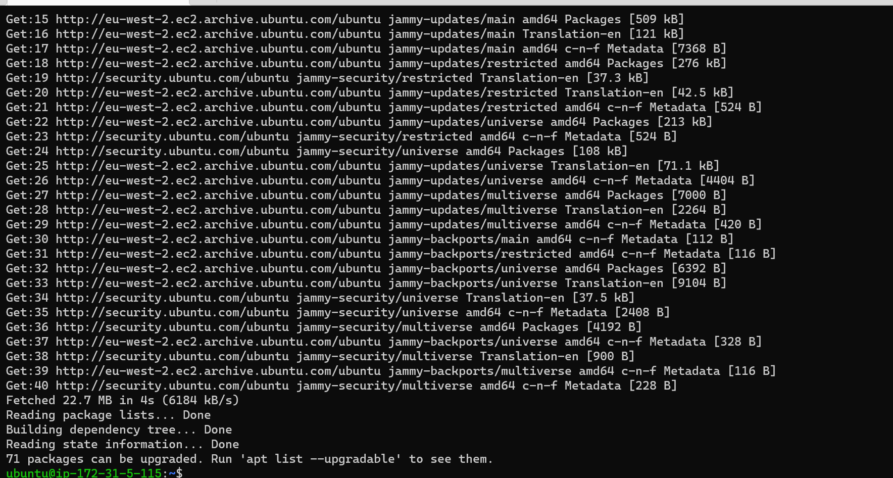
- upgrade ubuntu

`sudo apt upgrade`

the result is;
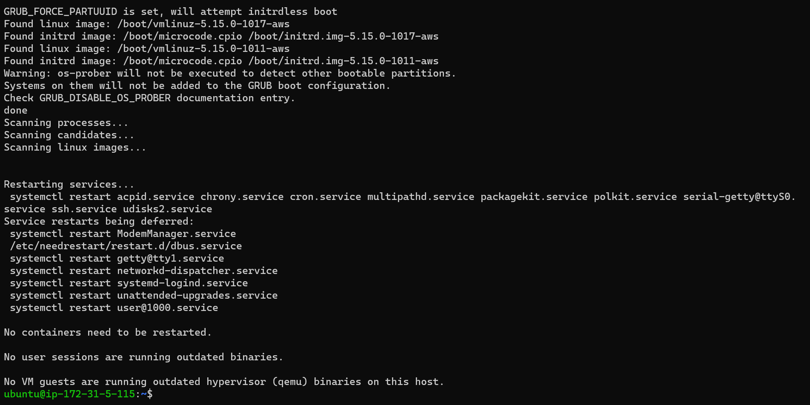
- Add certificates

`sudo apt -y install curl dirmngr apt-transport-https lsb-release ca-certificates`

the result is;
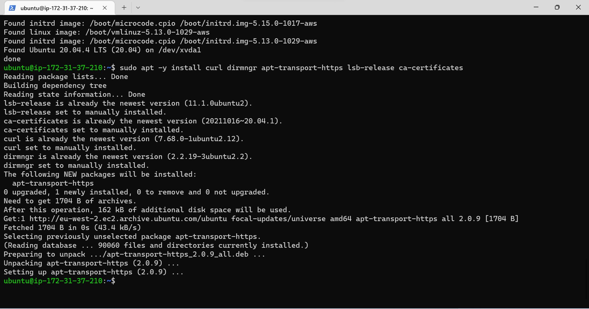

`curl -sL https://deb.nodesource.com/setup_12.x | sudo -E bash -`

the result is;
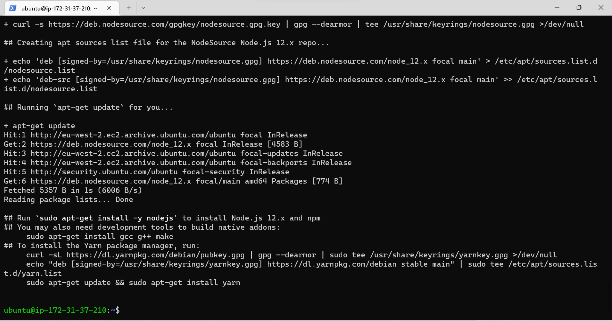

- Install NodeJs

`sudo apt install -y nodejs`

the result is;
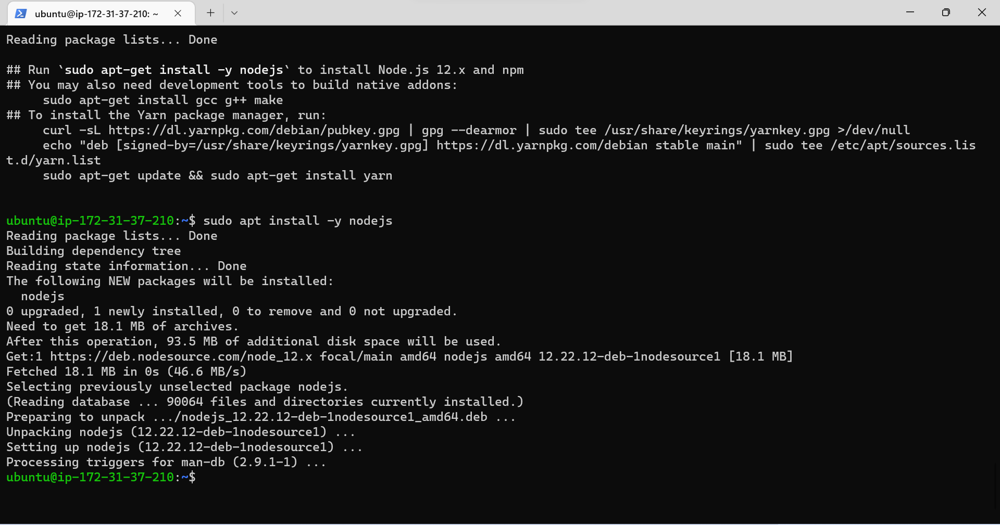

## STEP 2 - *INSTALL MONGODB*

MongoDB stores data in flexible, JSON-like documents. Fields in a database can vary from document to document and data structure can be changed over time. 

- For our example application, we are adding book records to MongoDB that contain book name, isbn number, author, and number of pages.mages/WebConsole.gif

`sudo apt-key adv --keyserver hkp://keyserver.ubuntu.com:80 --recv 0C49F3730359A14518585931BC711F9BA15703C6`

the result is;
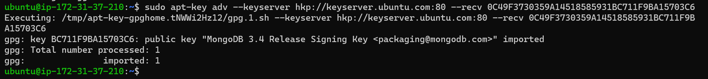

`echo "deb [ arch=amd64 ] https://repo.mongodb.org/apt/ubuntu trusty/mongodb-org/3.4 multiverse" | sudo tee /etc/apt/sources.list.d/mongodb-org-3.4.list`

the result is;
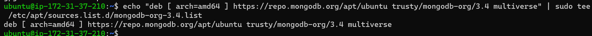

- install mongodb

`sudo apt install -y mongodb`

- start the server

`sudo service mongodb start`

- verify that the service is up and running

`sudo systemctl status mongodb`

the result is;
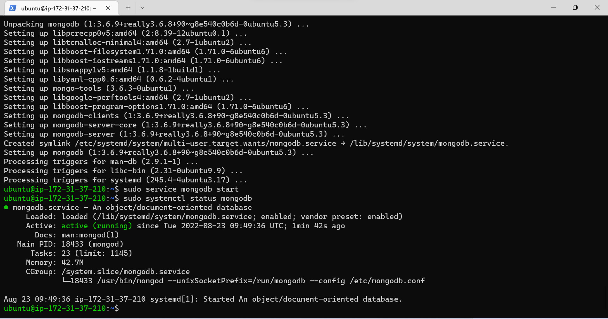

- Install npm – Node package manager.

`sudo apt install -y npm`

the result is;
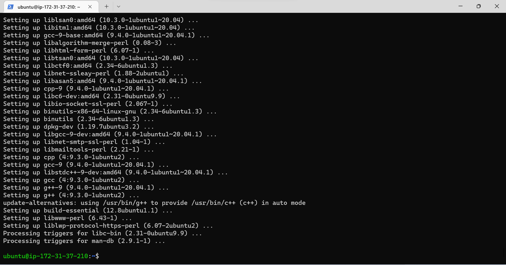

- Install body-parser package

body-parser’ package to help us process JSON files passed in requests to the server.

`sudo npm install body-parser`

the result is;
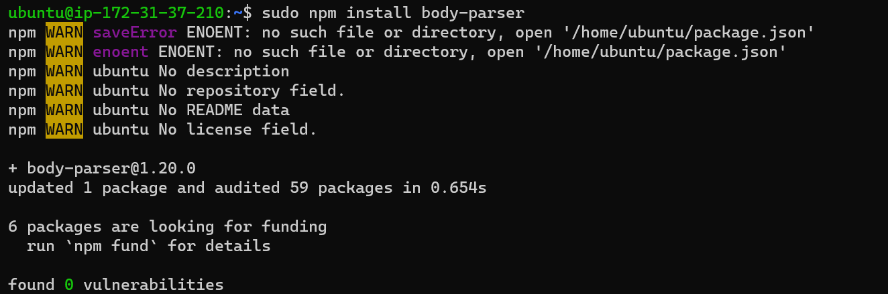

- Create a folder named ‘Books’

`mkdir Books && cd Books`

- In the Books directory, Initialize npm project

`npm init`

- Add a file to it named server.js

`vi server.js`

- copy and paste the code below into the server.js file

```
var express = require('express');
var bodyParser = require('body-parser');
var app = express();
app.use(express.static(__dirname + '/public'));
app.use(bodyParser.json());
require('./apps/routes')(app);
app.set('port', 3300);
app.listen(app.get('port'), function() {
    console.log('Server up: http://localhost:' + app.get('port'));
});
```

## STEP 3 - *INSTALL EXPRESS AND SET UP ROUTES TO THE SERVER*

Express is a minimal and flexible Node.js web application framework that provides features for web and mobile applications. We will use Express in to pass book information to and from our MongoDB database.

We also will use Mongoose package which provides a straight-forward, schema-based solution to model your application data. We will use Mongoose to establish a schema for the database to store data of our book register.

- Install Express Mongoose

`sudo npm install express mongoose`

- In ‘Books’ folder, create a folder named apps

`mkdir apps && cd apps`

- Create a file named routes.js

`vi routes.js`

- Copy and paste the code below into routes.js

```
var Book = require('./models/book');
module.exports = function(app) {
  app.get('/book', function(req, res) {
    Book.find({}, function(err, result) {
      if ( err ) throw err;
      res.json(result);
    });
  }); 
  app.post('/book', function(req, res) {
    var book = new Book( {
      name:req.body.name,
      isbn:req.body.isbn,
      author:req.body.author,
      pages:req.body.pages
    });
    book.save(function(err, result) {
      if ( err ) throw err;
      res.json( {
        message:"Successfully added book",
        book:result
      });
    });
  });
  app.delete("/book/:isbn", function(req, res) {
    Book.findOneAndRemove(req.query, function(err, result) {
      if ( err ) throw err;
      res.json( {
        message: "Successfully deleted the book",
        book: result
      });
    });
  });
  var path = require('path');
  app.get('*', function(req, res) {
    res.sendfile(path.join(__dirname + '/public', 'index.html'));
  });
};
```

- In the ‘apps’ folder, create a folder named models

`mkdir models && cd models`

- Create a file named book.js

`vi book.js`

- Copy and paste the code below into ‘book.js’

```
var mongoose = require('mongoose');
var dbHost = 'mongodb://localhost:27017/test';
mongoose.connect(dbHost);
mongoose.connection;
mongoose.set('debug', true);
var bookSchema = mongoose.Schema( {
  name: String,
  isbn: {type: String, index: true},
  author: String,
  pages: Number
});
var Book = mongoose.model('Book', bookSchema);
module.exports = mongoose.model('Book', bookSchema);
```

## STEP 4 -*ACCESS THE ROUTES USING ANGULARJS*

AngularJS provides a web framework for creating dynamic views in your web applications. In this project, we use AngularJS to connect our web page with Express and perform actions on our book register.

- Change the directory back to ‘Books’

`cd ../..`

- Create a folder named public

`mkdir public && cd public`

- Add a file named script.js

`vi script.js`

- Copy and paste the Code below (controller configuration defined) into the script.js file.

```
var app = angular.module('myApp', []);
app.controller('myCtrl', function($scope, $http) {
  $http( {
    method: 'GET',
    url: '/book'
  }).then(function successCallback(response) {
    $scope.books = response.data;
  }, function errorCallback(response) {
    console.log('Error: ' + response);
  });
  $scope.del_book = function(book) {
    $http( {
      method: 'DELETE',
      url: '/book/:isbn',
      params: {'isbn': book.isbn}
    }).then(function successCallback(response) {
      console.log(response);
    }, function errorCallback(response) {
      console.log('Error: ' + response);
    });
  };
  $scope.add_book = function() {
    var body = '{ "name": "' + $scope.Name + 
    '", "isbn": "' + $scope.Isbn +
    '", "author": "' + $scope.Author + 
    '", "pages": "' + $scope.Pages + '" }';
    $http({
      method: 'POST',
      url: '/book',
      data: body
    }).then(function successCallback(response) {
      console.log(response);
    }, function errorCallback(response) {
      console.log('Error: ' + response);
    });
  };
});
```

- In public folder, create a file named index.html;

`vi index.html`

- Cpoy and paste the code below into index.html file.

```
<!doctype html>
<html ng-app="myApp" ng-controller="myCtrl">
  <head>
    <script src="https://ajax.googleapis.com/ajax/libs/angularjs/1.6.4/angular.min.js"></script>
    <script src="script.js"></script>
  </head>
  <body>
    <div>
      <table>
        <tr>
          <td>Name:</td>
          <td><input type="text" ng-model="Name"></td>
        </tr>
        <tr>
          <td>Isbn:</td>
          <td><input type="text" ng-model="Isbn"></td>
        </tr>
        <tr>
          <td>Author:</td>
          <td><input type="text" ng-model="Author"></td>
        </tr>
        <tr>
          <td>Pages:</td>
          <td><input type="number" ng-model="Pages"></td>
        </tr>
      </table>
      <button ng-click="add_book()">Add</button>
    </div>
    <hr>
    <div>
      <table>
        <tr>
          <th>Name</th>
          <th>Isbn</th>
          <th>Author</th>
          <th>Pages</th>

        </tr>
        <tr ng-repeat="book in books">
          <td>{{book.name}}</td>
          <td>{{book.isbn}}</td>
          <td>{{book.author}}</td>
          <td>{{book.pages}}</td>

          <td><input type="button" value="Delete" data-ng-click="del_book(book)"></td>
        </tr>
      </table>
    </div>
  </body>
</html>
```

- Change the directory back up to Books

`cd ..`

- Start the server by running this command:

`node server.js`

the result is;
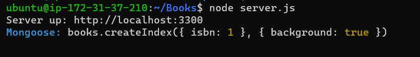

- open TCP port 3300 in the AWS Web Console for your EC2 Instance

- Using your public IP address from your Ubuntu server you can access the website.

the result is;
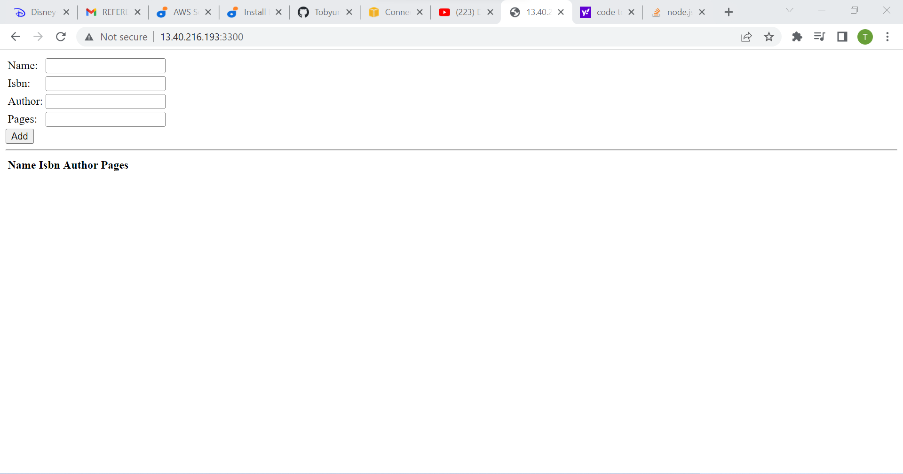