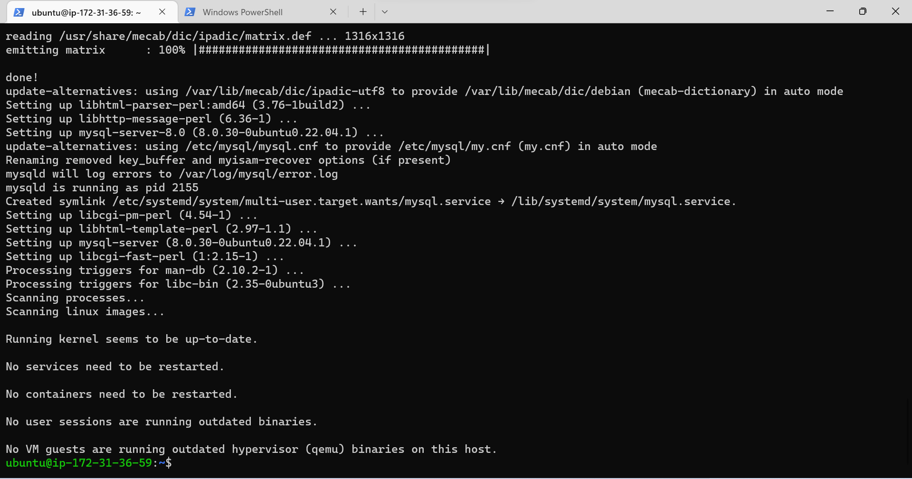
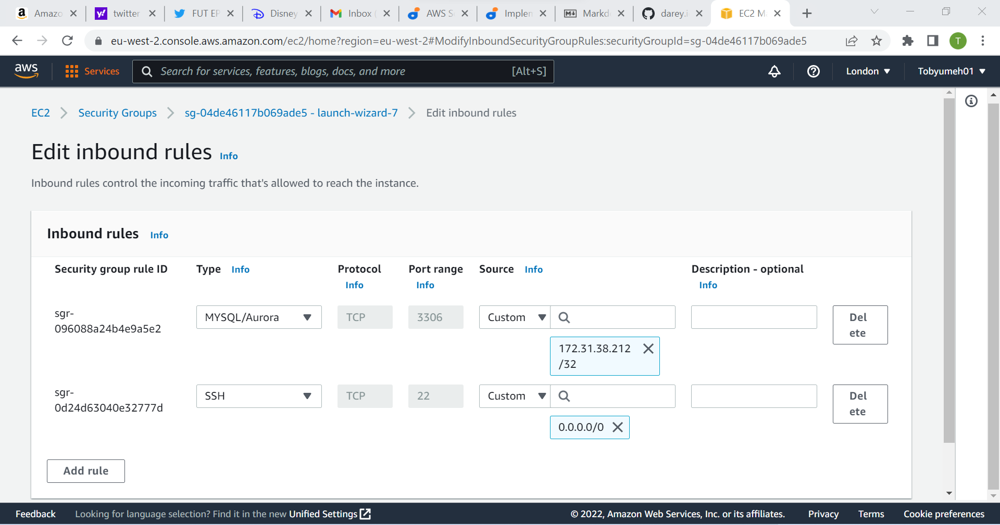
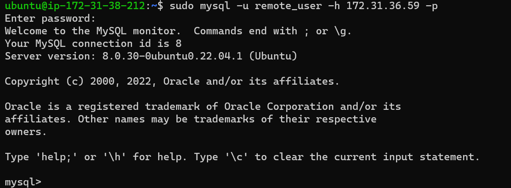

# IMPLEMENTING A CLIENT SERVER ARCHITECTURE USING MYSQL DATABASE MANAGEMENT SYSTEM (DBMS).

The task of the project is to implement a Client Server Architecture using MySQL Database Management System (DBMS).

Client-Server refers to an architecture in which two or more computers are connected together over a network to send and receive requests between one another.

In their communication, each machine has its own role: the machine sending requests is usually referred as "Client" and the machine responding (serving) is called "Server".

In the example above, a machine that is trying to access a Web site using Web browser or simply ‘curl’ command is a client and it sends HTTP requests to a Web server (Apache, Nginx, IIS or any other) over the Internet.

- Create and configure two Linux-based virtual servers (EC2 instances in AWS).

1. Server A name - `mysql server`
2. Server B name - `mysql client`

- On mysql server Linux Server install MySQL Server software.

`sudo apt update`

`sudo apt install mysql-server`

the result is;

- check the status of mysql

`sudo systemctl status mysql`

- On mysql client Linux Server install MySQL Client software.

`sudo apt update`

`sudo apt install mysql-client`

- Update the inbound rules in MYSQL server, by adding TCP port 3306. For extra security allow access only to private IP address of MYSQL client.

the result is;

- In MYSQL server, run the security script to prepare mysql database

`sudo mysql_secure_installation`

- Follow the instructions and set a new password.

- open mysql

`sudo mysql`

- Create a remote user by running

`CREATE USER 'remote user'@'%' IDENTIFIED WITH mysql_native_password BY 'PASSWORD';`

- Create database by running

`CREATE DATABASE test_db;`

- grant all privileges on the database 

`GRANT ALL ON test_db.* TO 'remote user'@'%' WITH GRANT OPTION;`

- Flush Privileges

`FLUSH PRIVILEGES;`

- Exit mysql

- Configure MYSQL server to allow connections from remote hosts

`sudo vi /etc/mysql/mysql.conf.d/mysqld.cnf`

- Replace ‘127.0.0.1’ to ‘0.0.0.0’

- from mysql client Linux Server connect remotely to mysql server Database Engine

the result is

- Confirm successfully connection to the remote MySQL server and perform SQL queries by running

`show databases;`

the result is;
